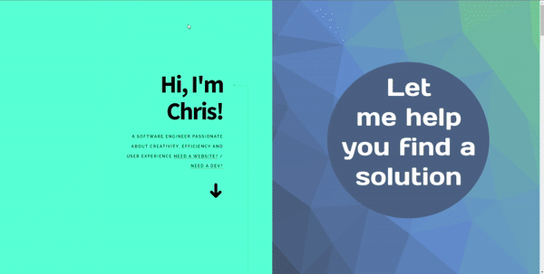
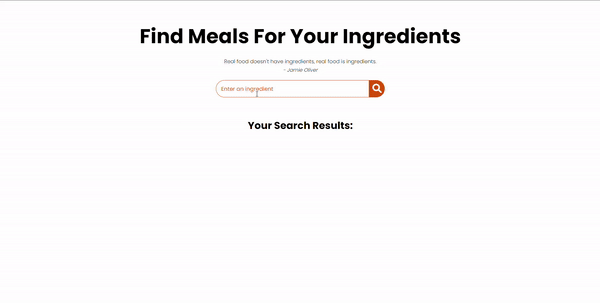

<h1 align="center">Hi , I'm Chris!</h1>
<h3 align="center">I'm an innovative, goal-oriented software engineer with a passion for positive user experiences. I'm an avid learner who is adaptable and can thrive in varying environments. Open-minded. Always curious. </h3>

 

  
  
  
 <!--   -->
  <!--  -->

## 🙋‍♂️ About Me

- 🌱 I’m currently working at the **100devs** agency

- 👯 I’m looking to collaborate on **OpenSource Projects**

- 👨‍💻 All of my projects are available at **[My Portfolio](https://christurcios.netlify.app)**

- 📫 How to reach me **chris.turcios@protonmail.com**

- ⚡ Fun fact **I am a volunteer firefighter** 🚒

## 🚀 Languages and Tools:

 
     
     
     
     
     
       
     
    
    

<!--       -->
 

<h1 align="center">Projects</h1>
<table bordercolor="#66b2b2">
  
  <tr>
    <td width="50%" valign="top">
      <h3 align="center">Portfolio</h3>
         
        
         
        
        
    
  
      

        
<strong>HTML, CSS3, JavaScript</strong> - Portfolio site including links to my projects and a form to get in contact with me

    </td>
    <td width="50%" valign="top">
      <h3 align="center">Boozgle</h3>
         
      
         
        

  
  
      

        
<strong>HTML, CSS3, JavaScript, Cocktail DB API</strong> - Find your next cocktail drink recipe by typing in a type of alcohol!

    </td>
  </tr>
  
  <tr>
    <td width="50%" valign="top">
      <h3 align="center">Recipe Generator</h3>
       
        
       
        

  
  
      

        
<strong>HTML5, CSS3, Javascript, API</strong> - Find several meals to make based on an ingredient available to you. Links to Youtube videos available in the instructions.

    </td>
    <td width="50%" valign="top">
      <h3 align="center">Interi Agency</h3>
         
        
         
            

  
  
      

        
<strong>HTML5, CSS3, & Javascript</strong> - Website made for Interi interior design agency. Fully responsive.

    </td>
  </tr>

  <tr>
    <td width="50%" valign="top">
      <h3 align="center">FlickList</h3>
       
        
       
        

  
  
      

        
<strong>HTML5, CSS3, Javascript, EJS, MongoDB, Express, NodeJS, API, Passport</strong> - Create your very own list of recommended movies to watch! Connect to Movies database to pull info about movies you've entered.

    </td>
    <td width="50%" valign="top">
      <h3 align="center">TreatMeals</h3>
         
        
         
        

  
  
      

        
<strong>HTML5, CSS3, Javascript, EJS, MongoDB, Express, NodeJS, API, Passport, Chartjs, Bootstrap</strong> - Fullstack CRUD app that allows users to find macronutrient information for the foods at their favorite restaurants.

    </td>
  </tr>

</table>

 

 

 ## Connect with me:

 

<!-- ## ❤ Views and Followers

 -->
